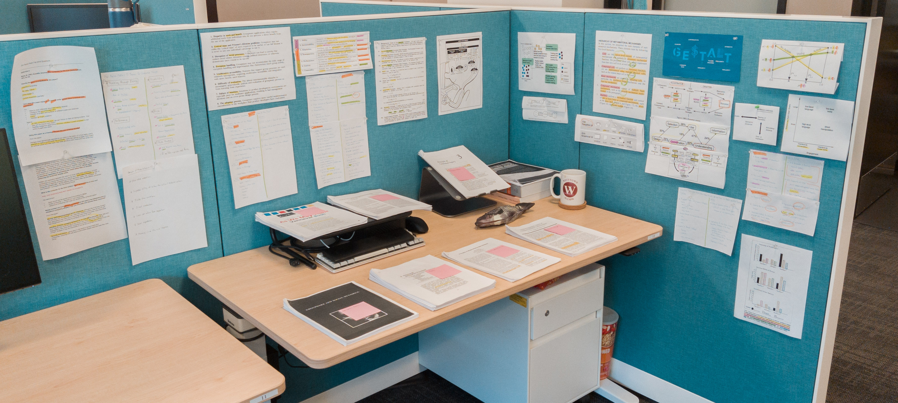

# UC Berkeley HCI Preliminary Exam Study Guides
We created this website to help students prepare for the Human-Computer Interaction (HCI) preliminary exam at UC Berkeley.
We hope that this website will be a useful resource for students to learn about the exam and to prepare for it.
This guides contain the exam reading list, previous years' questions, and study guides/nodes from previous students (Coming Soon).